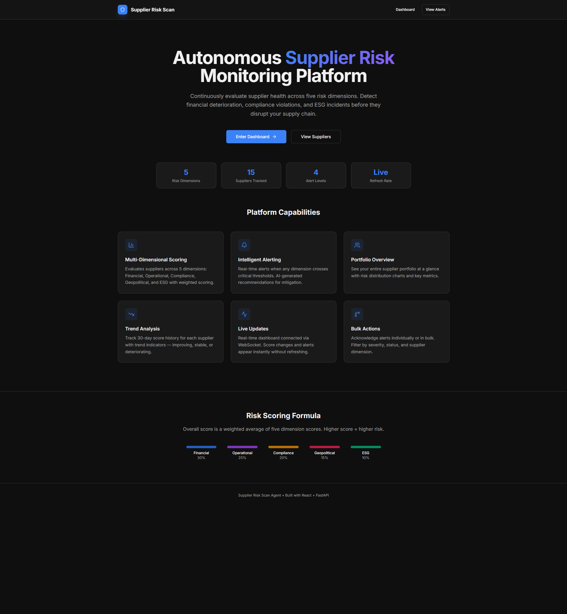
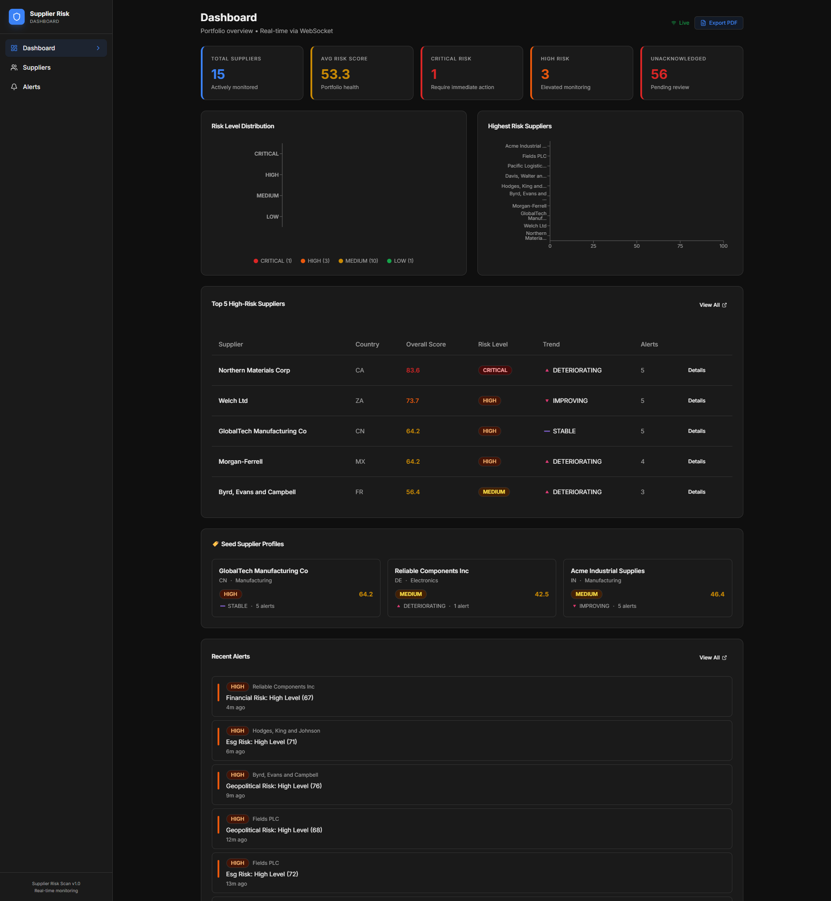
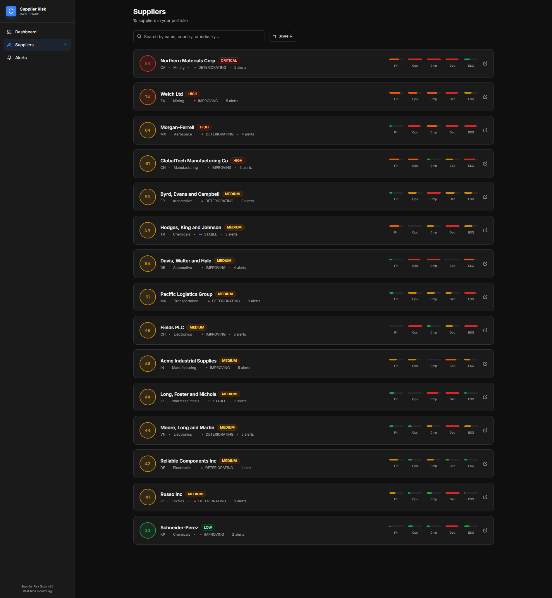
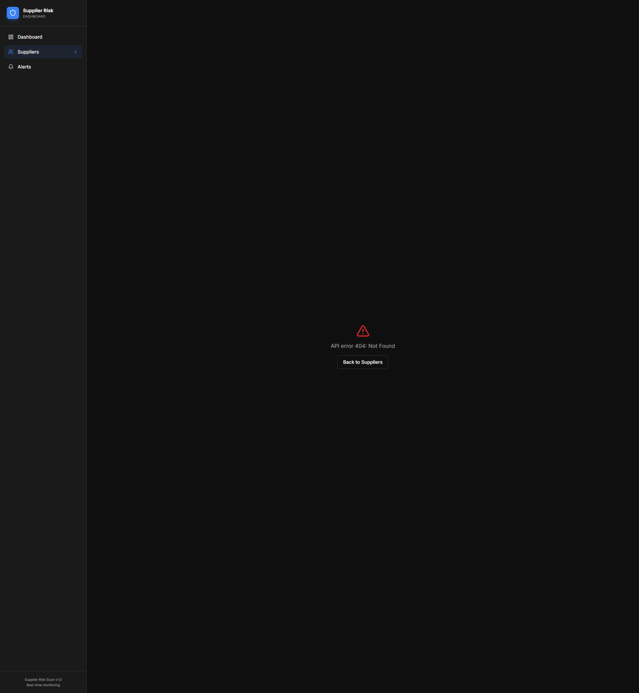
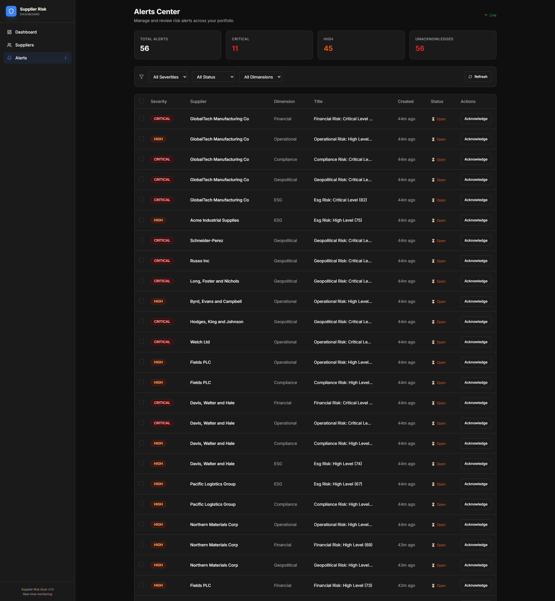

# Supplier Risk Scan Agent

An automated system that keeps track of supplier health across five risk categories: financial health, operational performance, compliance status, geopolitical exposure, and ESG factors.

When a supplier's score crosses a danger threshold, the system writes an alert with a title, explanation, and three recommended actions. The alerts appear on the dashboard in real time through a WebSocket connection. You do not need to refresh the page.



## Quick Start

### Prerequisites

You need Docker and Docker Compose installed on your machine.

### Setup

1. Clone the repository.

2. Copy the environment file and add your API key (optional -- the app works without it, just uses pre-written fallback alerts):

```
cp backend/.env.example backend/.env
```

Open `backend/.env` and set your key if you have one.

3. Build and start:

```
docker-compose up --build
```

4. Open http://localhost:3000 in your browser.

The backend API is available at http://localhost:8000.

### Stopping

```
docker-compose down
```

## What It Does

### Risk Scoring

Each supplier gets a score from 0 (safe) to 100 (high risk) across five dimensions:

- Financial (30% weight) -- based on credit score, profit margin, payment speed, debt level
- Operational (25% weight) -- based on delivery punctuality, defect rate, capacity usage
- Compliance (20% weight) -- based on violations, certification expiry
- Geopolitical (15% weight) -- based on country risk and trade restrictions
- ESG (10% weight) -- average of environmental, social, and governance subscores

The overall score is a weighted average: 0.30 * Financial + 0.25 * Operational + 0.20 * Compliance + 0.15 * Geopolitical + 0.10 * ESG

### Risk Levels

| Score Range | Level | Alert Triggered? |
|---|---|---|
| 0 to 39 | LOW | No |
| 40 to 59 | MEDIUM | No |
| 60 to 74 | HIGH | Yes |
| 75 to 100 | CRITICAL | Yes |

An alert also fires when any single dimension score goes above 65 (HIGH) or 80 (CRITICAL), even if the overall score looks fine.

### Background Scanner

A background process runs every 8 seconds. It picks three random suppliers, tweaks their dimension scores slightly (simulating normal business changes), and checks if any thresholds were crossed. When one is crossed, it calls an AI model to write the alert, then pushes the update to all connected dashboards through a WebSocket.

### Real-Time Dashboard

The dashboard uses WebSockets instead of polling. When the scanner updates a score or generates a new alert, the change appears on the page immediately. There is a green "Live" indicator in the top right corner that shows the connection status.

## Pages

### Dashboard

Overview with KPI cards, risk distribution chart, top suppliers table, and recent alerts feed. Alerts arrive as toast notifications with a pulsing badge counter. The "Export PDF" button in the header generates a landscape report with all dashboard data.



### Suppliers

Full list of all 15 suppliers with search and sort.



### Supplier Detail

Detail view with score gauge, radar chart, 30-day history timeline, and active alerts.



### Alerts

Alert center with filters for severity, status, and dimension. Supports individual and bulk acknowledgment.



## Mock Data

The system creates 15 suppliers when it starts:

1. **GlobalTech Manufacturing Co** -- critical risk, deteriorating trend, based in China. Comes with several critical alerts already attached.
2. **Reliable Components Inc** -- low risk, stable trend, based in Germany. All scores are below 25. No alerts.
3. **Acme Industrial Supplies** -- medium-to-high risk, deteriorating trend, based in India. ESG score is above 70.
4. **Northern Materials Corp** -- scores sit just below the alert threshold. First scanner cycle usually triggers an alert.
5. **Pacific Logistics Group** -- same setup as Northern Materials, for demo reliability.
6. **10 random suppliers** -- spread across LOW, MEDIUM, HIGH, and CRITICAL tiers.

All data is held in memory and resets every time the application restarts.

## API Endpoints

| Method | Path | Description |
|---|---|---|
| GET | /suppliers | List all suppliers |
| GET | /suppliers/:id | Single supplier with 30-day history |
| GET | /alerts | List alerts. Supports ?severity, ?acknowledged, ?supplier_id |
| PATCH | /alerts/:id/acknowledge | Mark one alert as acknowledged |
| POST | /alerts/bulk-acknowledge | Acknowledge multiple alerts at once |
| GET | /stats | Portfolio summary (totals, averages, counts) |
| WS | /ws | WebSocket for real-time events |

## Tech Stack

- **Backend:** Python 3.12, FastAPI, Uvicorn
- **Frontend:** React 19, TypeScript, Vite, Recharts, Tailwind CSS
- **AI:** OpenRouter API (routes to free models for alert text generation)
- **Infrastructure:** Docker, Docker Compose, Nginx
- **Testing:** Pytest (106 backend tests)

## Project Structure

```
supplier-risk-scan/
  backend/
    app/
      main.py           -- FastAPI app, startup, WebSocket endpoint
      routes.py         -- REST API handlers
      models.py         -- Pydantic data models
      risk_scorer.py    -- Score calculation functions
      alert_engine.py   -- AI alert generation via OpenRouter
      scanner.py        -- Background risk monitoring loop
      mock_data.py      -- Supplier data generator
      ws_manager.py     -- WebSocket connection manager
    tests/              -- Pytest test suite
    Dockerfile
  frontend/
    src/
      pages/            -- Dashboard, Suppliers, Alerts, Detail, Landing
      components/       -- Reusable UI components
      lib/              -- API client, WebSocket client, utilities
      types/            -- TypeScript type definitions
    Dockerfile
    nginx.conf          -- Production nginx config
  docker-compose.yml
  README.md
  DESIGN.md
```

## Environment Variables

| Variable | Required | Default | Description |
|---|---|---|---|
| OPENROUTER_API_KEY | No | (empty) | API key for AI-generated alert content |

Without the API key, alerts use built-in fallback text. All other features work normally.

## Running Without Docker

### Backend

```
cd backend
uv sync
uv run uvicorn app.main:app --port 8000
```

### Frontend

```
cd frontend
npm install
npm run dev
```

The Vite dev server proxies /api and /ws to the backend automatically.
